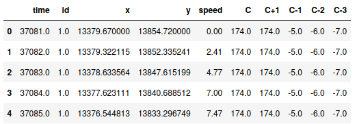
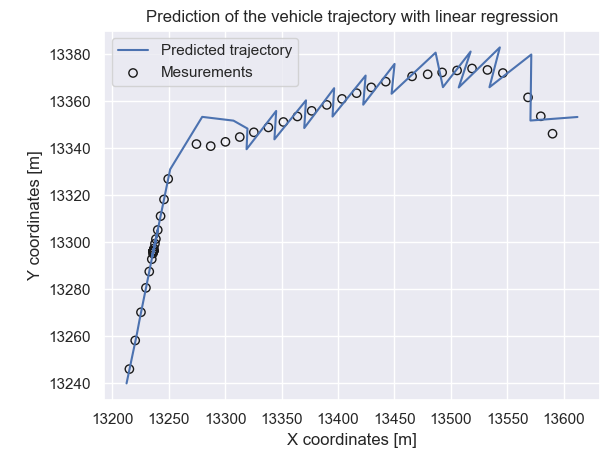
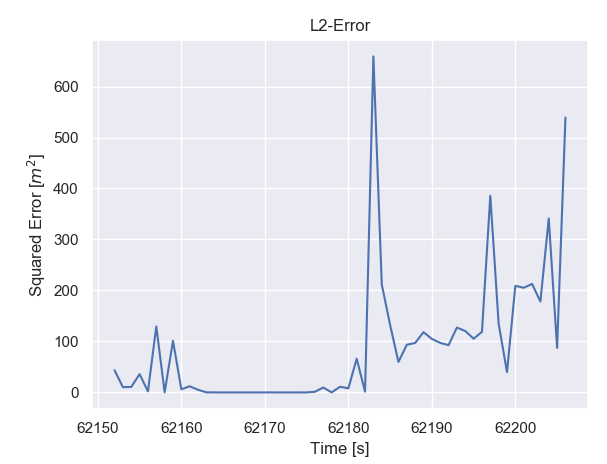
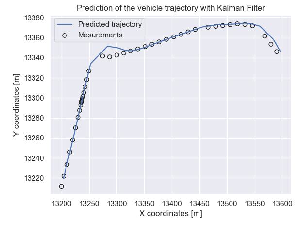
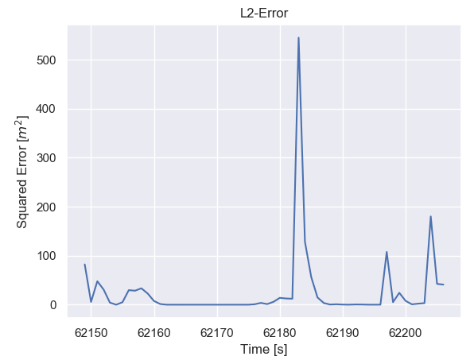
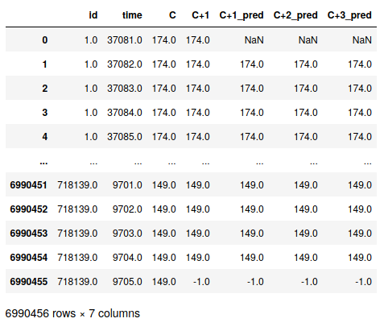

### Credits
The following project has been developed (on Bitbucket) for the High Level Programming course at the University of Padua. 
The students involved are Federico Fiorenzoli, Aniello Xie, Carlo Facchin and Andrea Manzato. 
This file is just a brief description of the project. 

# Urban Mobility for 5G Cellular Networks
The scenario considered is a urban 5G scenario in the center of the city of Cologne (900 x 700 meters), with 5G enabled vehicles that move around while being continuously connected to the 5G network. The mobility is emulated with SUMO, an open-source traffic simulation suite that allows generating the movement of emulated users around a predefined city road map, and extracting the needed metrics. Base stations (BSs) were deployed on a grid topology, and the mobility area has been covered with hexagonal 5G cells with a radius of 40 m, each with a BS in its center.

The dataset is composed of two files, not available in this GitHub repository.

1. In the file "traces.mat" the following mesurements are provided:
- time of the measurement in seconds;
- vehicle ID;
- absolute x coordinate of the vehicle location in meters;
- absolute y coordinate of the vehicle location in meters;
- speed of the vehicle in meters over second;
- hexagonal cell associated with the x-y location (i.e., serving base station (BS));
- hexagonal cell to which the user will be connected in the next time step (cell C+1);
- hexagonal cell visited before the current one (cell C-1) no matter how much time before (i.e., previous serving BS);
- hexagonal cell C-2;
- hexagonal cell C-3;

A negative number in a cell column is referred to time steps out of the recorded trajectory.

2. The file "coordinate_BS.mat" provides:
- absolute x coordinate of the BS location in meters;
- absolute y coordinate of the BS location in meters;

An example of the provided traces data:  
</img>

## Proposed challanges

Location information and prediction can be exploited to enhance the 5G network performance, through location and mobility-aware allocation of communications and computing tasks in 5G edge networks.

The proposed challenges exploit vehicles mobility to estimate and predict useful information for network management.

The problems considered in the notebook are:

- dynamic visualization of the provided data (currently not described here);
- prediction and visualization of the time a user will remain under the coverage of a BS (currently not described here);
- estimation of the position where the vehicle can be found in subsequent time instants with linear regression and Kalman filter;
- estimation of the next serving BS and prediction of the number of users inside each cell for the following time slots.

## Prediction Algorithms

### Linear Regression

The Linear Regression is a method used to estimate the relation between some explanatory variables and some real valued outcome. In our case we tried to find the relation between the time-steps and the X,Y coordinates of vehicles.
Analyzing the available data, it was noticed that a vehicle could enter, exit, and re-enter the tracking area several times, so in order not to have problems of time jumps, we decided to extract the longest continuous time track of the vehicle taken into consideration.

The Regression is set to use the last n-positions in order to estimare the new one.
For our tests we used a set of 5 older positions to train and predict the new one at each step.
The standard Linear Regressione return very bad results for acceleration or when there are curves or turns with tight angles, so we "customized" the Regression algorithm in order that it will try to "fix" the last position that has predicted with a error larger that a predefined threshold. This has improved the overall prediction performance.

In order to get the best window-size and the best correction parameter-p we implemented a grid-search that will compute the best parameters for a predefined n-vehicles, after that we'll use the obtained 'best parameters' to make predictions.

An example of the trajectory of a car with the linear regression:  

</img>

And the related L2 error:  

</img>

As we can see from the animation the prediction is note very stable and suffer a lot from accelerations and curves, so we tried another method, the Kalman Filter.

## Kalman filter

For the prediction of the next position an alternative approach uses the Kalman Filter. The Kalman filter uses the previous state of the vehicle (position and speed) to estimate the next position.

An example of the trajectory of a car with the Kalman Filter:  

</img>

And the related L2 error:  

</img>

Since the Kalman Filter returns better results we chose it to make predictions on the next serving base station for every car.  
We made 3 predictions on the position of a car for every measurement: after 1,2 and 3 seconds.
We have following estimated the serving base station in the predicted position.

## Prediction of the next serving Base stations for every car and every time

The prediction of the next base station given only a measurement is NaN since it's impossible to make reasonable predictions.

An example of the results of the estimation:  

</img>

Finally the results of our prediction are:  
- correctness of predicted BS at C+1 (after 1s) = 85.9249%;  
- correctness of predicted BS at C+2 (after 2s) = 79.6343%;  
- correctness of predicted BS at C+2 (after 3s) = 73.8752%.  

A dynamic representation of the results is provided in the jupyter notebook.

An example of the predicted load for the all the base stations at the second t=59045:  
</img>

### Notes:
The full project, without the data, is described in the "final_project_group_19.ipynb" file. However, since no data are provided, it's currently not by working cloning this repository. 
